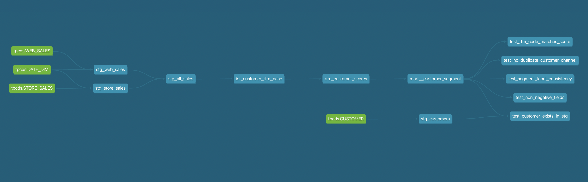
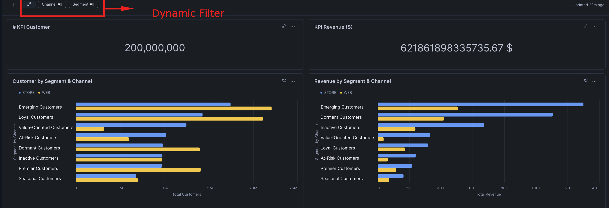

# Customer Segmentation with dbt + Snowflake (RFM)

RFM-based customer segmentation built with **dbt** on **Snowflake**, using the Snowflake **TPC-DS sample data**.  
The project unifies **Store** and **Web** sales, scores customers on **Recency, Frequency, Monetary (RFM)**, and assigns clear, business-friendly segments for targeted marketing.

> ✅ Modular dbt pipeline • ✅ Tested & documented • ✅ Dashboard-ready in Snowsight

---

## What this produces

**Final MART tables**
- **`RFM_CUSTOMER_SCORES`** — per customer (+channel) R/F/M metrics and 1–5 scores  
- **`MART__CUSTOMER_SEGMENT`** — final, business-friendly segment labels

**Segment examples**
- **Premier** (recent, frequent, high-spend)  
- **Loyal** (very frequent, solid spend)  
- **High-Value Recent** (big spenders who bought very recently)  
- **Emerging** (newly active; not yet frequent/high-spend)  
- **High Spend** (large baskets; decent recency)  
- **Value-Oriented** (buy often; lower spend per period)  
- **Seasonal** (activity in cycles)  
- **At-Risk / Dormant** (long since last purchase; some worth win-back)

---

## How it works (RFM in plain English)

- **Recency (R):** days since the last purchase (more recent → higher score)  
- **Frequency (F):** number of purchases (more often → higher score)  
- **Monetary (M):** total spend (higher → higher score)

Each pillar is ranked into **five bands (1–5)**; `R,F,M` combine into a customer "fingerprint" that maps to a segment.

---

## High-level model flow (dbt)

**STG (views)**
- Standardize inputs from TPC-DS (`STORE_SALES`, `WEB_SALES`, `CUSTOMER`, `DATE_DIM`)
- Align column names/types and create a `channel` flag (STORE / WEB)
- **Union** Store + Web into `stg_all_sales`

**INT (view/table)**
- Aggregate by `customer_id` (+ `channel`) to derive:  
  `last_purchase_date`, `recency_days`, `frequency`, `monetary`

**MART (tables)**
- Convert metrics to **R/F/M scores (1–5)**
- Map score combinations to **segment labels**
- Expose curated tables for analytics & activation

---

## Testing & QA

This repo uses both **generic tests** (in `schema.yml`) and **singular tests** (custom SQL in `/tests`).

### Generic tests
- **Key integrity:** `unique` + `not_null` on primary keys (e.g., `customer_id`)
- **Data quality:** `not_null` on dates/amounts; `accepted_values` for `channel` (`STORE`, `WEB`)

### Singular tests (custom SQL under `/tests`)

| File | What it checks | Why it matters |
|---|---|---|
| `tests/test_customer_exists_in_stg.sql` | Every downstream customer exists in `stg_customers` | Avoid orphan rows introduced by joins/unions |
| `tests/test_no_duplicate_customer_channel.sql` | `(customer_id, channel)` is unique in `MART__CUSTOMER_SEGMENT` | Prevents double counting per channel |
| `tests/test_non_negative_fields.sql` | `frequency ≥ 0`, `monetary ≥ 0`, `recency_days ≥ 0` | Catches negative/invalid metrics |
| `tests/test_rfm_code_matches_score.sql` | `rfm_code` equals `r_score || f_score || m_score` | Keeps code representation in sync with scores |
| `tests/test_segment_label_consistency.sql` | Each `segment_label` matches the R/F/M rule thresholds | Protects business logic from drift |

**Run tests**
```bash
# all tests
dbt test

# only singular tests
dbt test --select path:tests
```

---

# Snowflake Snowsight Dashboard — RFM Customer Segmentation

A complete guide to recreate the **RFM Customer Segmentation** dashboard in **Snowsight**.  
Assumes your mart tables live in `CUSTOMER_ANALYTICS.MART` and include:
- `MART__CUSTOMER_SEGMENT` (final labels)
- `RFM_CUSTOMER_SCORES` (scores & metrics)

> **Tip:** Prefer **Column Filters** over SQL keyword parameters; they inject the `WHERE` clause automatically across tiles.

---

## 1) Context & Defaults

- **Database / Schema:** `CUSTOMER_ANALYTICS.MART`  
- **Warehouse:** `WH_ANALYTICS` (or any size you prefer)  
- **Grain:** `MART__CUSTOMER_SEGMENT` is one row per `customer_id` **per `channel`** (STORE/WEB).  
  - For "unique customers" across channels, use `COUNT(DISTINCT customer_id)`.

---

## 2) Filters (Add Once → Apply to All Tiles)

Create **Column Filters** via **Dashboard → Filters → + Filter → Column**:

### 2.1 `CHANNEL`
- Column: `CHANNEL`
- Multi-select: **On**
- Include "All": **On**
- Apply to: **All tiles**

### 2.2 `SEGMENT_LABEL`
- Column: `SEGMENT_LABEL`
- Multi-select: **On**
- Include "All": **On**
- Apply to: **All tiles**

> Optional date controls require a sales-level model with a date column. The mart tables here are already aggregated by customer/channel.

---

## 3) KPI Tiles

### 3.1 KPI — Total Customers (row grain)
```sql
SELECT COUNT(*) AS total_customers
FROM CUSTOMER_ANALYTICS.MART.MART__CUSTOMER_SEGMENT;
```

### 3.2 KPI — Total Revenue
```sql
SELECT ROUND(SUM(monetary), 2) AS total_revenue
FROM CUSTOMER_ANALYTICS.MART.MART__CUSTOMER_SEGMENT;
```

---

## 4) Clustered Bar Charts

### 4.1 Customers by Segment & Channel
```sql
SELECT
  segment_label,
  channel,
  COUNT(*) AS customers
FROM CUSTOMER_ANALYTICS.MART.MART__CUSTOMER_SEGMENT
GROUP BY 1, 2
ORDER BY customers DESC;
```

### 4.2 Revenue by Segment & Channel
```sql
SELECT
  segment_label,
  channel,
  SUM(monetary) AS total_revenue
FROM CUSTOMER_ANALYTICS.MART.MART__CUSTOMER_SEGMENT
GROUP BY 1, 2
ORDER BY total_revenue DESC;
```

---

## 5) Screenshots

### 5.1 Project Graph Lineage


### 5.2 Dashboard

